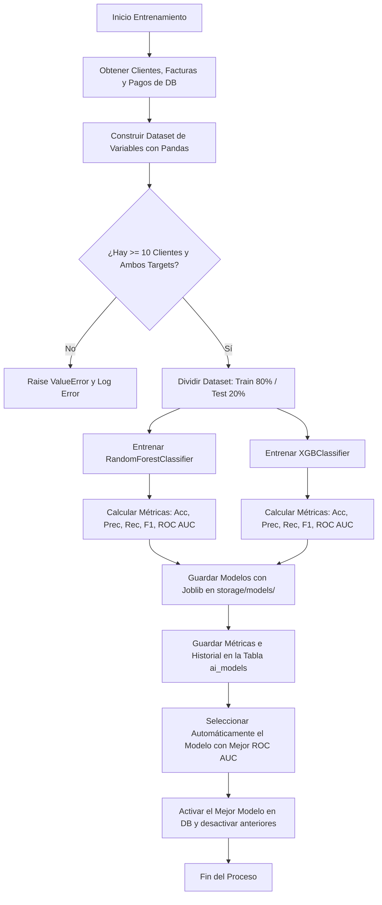
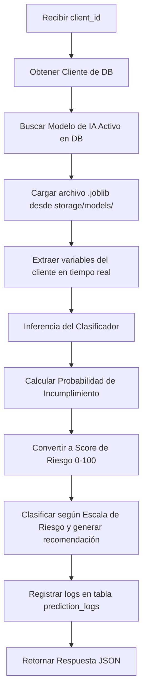

# Módulo de Inteligencia Artificial para Predicción de Mora y Riesgo Crediticio

Este módulo está desarrollado bajo **Clean Architecture**, siguiendo los patrones existentes del sistema de cartera SaaS multi-tenant y optimizado para la producción con **SQLAlchemy 2.0**, **Flask-RESTX (Swagger)**, **Marshmallow** y **Flask-JWT-Extended**.

---

## 📂 Estructura del Módulo

El código se encuentra organizado dentro de `app/ia/` de la siguiente manera:

```text
app/ia/
├── controllers/          # Controladores HTTP (Flask-RESTX Resources)
│   ├── __init__.py
│   └── ai_controller.py  # Endpoints REST, parsing, roles y serialización
├── services/             # Lógica de Negocio / Casos de Uso
│   ├── __init__.py
│   ├── model_training_service.py # Orquestación del entrenamiento y selección
│   └── prediction_service.py     # Inferencia de riesgo y reglas de negocio
├── repositories/         # Capa de Acceso a Datos (Patrón Repository)
│   ├── __init__.py
│   ├── ai_model_repository.py    # Operaciones DB para modelos de IA
│   └── prediction_repository.py  # Operaciones DB para logs de predicciones
├── ml/                   # Componentes de Machine Learning
│   ├── __init__.py
│   └── features.py       # Extracción de variables y estructuración de datasets
├── routes/               # Declaración de Namespaces y Rutas
│   ├── __init__.py
│   └── ai_routes.py
├── schemas/              # Validación y Serialización (Marshmallow)
│   ├── __init__.py
│   └── ai_schemas.py     # Esquemas de serialización para respuestas API
└── modelos/              # Directorio de modelos locales (Placeholder)
```

---

## 📊 Feature Engineering (Variables Derivadas)

El modelo de Machine Learning no solo lee límites de crédito, sino que analiza el comportamiento dinámico y de pago de los clientes a partir de las entidades reales del sistema (`clientes`, `facturas`, `pagos`, `historial_cobranza`):

1. **`limite_credito`**: Límite de crédito actual del cliente.
2. **`dias_plazo`**: Términos de pago acordados (ej. 30 días).
3. **`total_facturas`**: Cantidad total de facturas emitidas históricamente.
4. **`facturas_pagadas`**: Total de facturas pagadas (`saldo_pendiente == 0`).
5. **`facturas_vencidas`**: Facturas actualmente vencidas (impagas con fecha de vencimiento menor al día de corte).
6. **`total_monto_facturado`**: Sumatoria histórica facturada al cliente.
7. **`saldo_pendiente_total`**: Deuda total vigente del cliente.
8. **`monto_promedio_factura`**: Promedio del valor de las facturas emitidas.
9. **`ratio_saldo_limite`**: Relación entre la deuda actual y el límite de crédito (`saldo_pendiente_total / limite_credito`).
10. **`promedio_dias_pago`**: Promedio de días de retraso en pagos históricos. Para facturas pagadas, es la diferencia de días entre el último pago y el vencimiento. Para facturas vencidas impagas, se mide respecto a la fecha actual.
11. **`max_dias_mora`**: Retraso máximo en días registrado en su historial.
12. **`tasa_mora`**: Fracción de facturas que tuvieron pago tardío o se encuentran vencidas.
13. **`cantidad_notas_cobranza`**: Frecuencia de intervenciones de cobranza registradas en `historial_cobranza`.

---

## 🛠️ Flujo de Entrenamiento y Selección

El proceso de entrenamiento se orquesta en `ModelTrainingService` a través del endpoint `POST /api/v1/ai/train`:



---

## 🔮 Flujo de Inferencia (Predicción)

El proceso de predicción individual se realiza en `PredictionService` mediante el endpoint `POST /api/v1/ai/predict/<client_id>`:



### Escala de Riesgo Financiero

| Puntaje (Score) | Nivel de Riesgo | Recomendación Sugerida |
|---|---|---|
| **0 - 20** | MUY BAJO | Sin observaciones / Aprobación estándar |
| **21 - 40** | BAJO | Monitoreo estándar |
| **41 - 60** | MEDIO | Monitoreo periódico |
| **61 - 80** | ALTO | Seguimiento preventivo |
| **81 - 100** | MUY ALTO | Acción de cobro inmediata / Suspensión de crédito |

---

## 🔒 Seguridad y Roles

Todos los endpoints del módulo requieren autenticación mediante **JWT**.

* El rol del usuario se recupera de los claims del token JWT (`additional_claims={"role": "..."}`).
* Los endpoints de **Entrenamiento (`POST /train`)** y **Activación (`PUT /models/<id>/activate`)** están estrictamente protegidos con el decorador `@admin_required()`, exigiendo que el claim `role` sea exactamente `"ADMIN"`. En caso contrario, se deniega el acceso con un error `403 Forbidden`.

---

## 🚀 Instrucciones de Despliegue

1. **Migración de Base de Datos**:
   Aplica las nuevas tablas de base de datos utilizando Alembic:
   ```bash
   python -m alembic upgrade head
   ```

2. **Permisos de Almacenamiento**:
   Asegúrate de que la carpeta de almacenamiento de modelos exista y tenga permisos de lectura y escritura para el servidor de Flask:
   ```bash
   mkdir -p storage/models
   ```

3. **Ejecutar Pruebas Unitarias y de Integración**:
   Para ejecutar los tests de forma directa y verificar que las métricas de cobertura cumplan el objetivo:
   ```bash
   python -m unittest discover -s tests
   ```
   Para obtener el reporte detallado de cobertura:
   ```bash
   python -m coverage run -m unittest discover -s tests
   # Imprimir reporte
   python -m coverage report --include="app/ia/*"
   ```

---

## 🌐 Referencia de la API REST

Los endpoints se exponen bajo el prefijo `/api/v1/ai`:

* **`POST /train`** *(Solo ADMIN)*: Entrena RandomForest y XGBoost, evalúa métricas, persiste y activa el mejor de forma automática.
* **`GET /models`**: Retorna el listado de todos los modelos entrenados en el histórico.
* **`PUT /models/<id>/activate`** *(Solo ADMIN)*: Activa manualmente el modelo especificado por `id` y desactiva todos los demás.
* **`POST /predict/<client_id>`**: Realiza inferencia de mora para un cliente en específico.
* **`GET /predictions`**: Consulta los registros históricos de predicciones realizadas por el sistema (soporta paginación mediante query params `page` y `per_page`).
